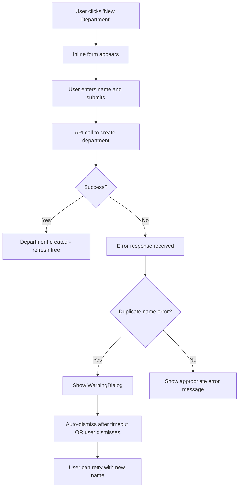

# Plan: Duplicate Department Warning Dialog

## Overview
Implement a sliding top-warning dialog that appears when attempting to create a department with a name that already exists. This replaces the current auto-rename behavior with a user-facing warning.

## User Requirements
- **Animation**: Sliding from top of screen
- **Content**:
  - Main message: "The file named [nameOfTheFile] already exists"
  - Subtitle: "Department names must be unique"
- **Placement**: Fixed position at top of screen (toast-style notification)
- **Trigger**: Only on department creation with duplicate name

---

## Phase 1: Research & Best Practices (REQUIRED BEFORE IMPLEMENTATION)

Before any implementation begins, conduct thorough research on:

### 1.1 React Toast/Notification Libraries
- Compare popular libraries: `react-hot-toast`, `react-toastify`, `sonner`, `notistack`
- Evaluate based on:
  - Animation quality and customization
  - Accessibility support
  - Bundle size
  - TypeScript support
  - Ease of integration with existing Zustand store

### 1.2 Animation Best Practices
- Research CSS animation performance for slide-in effects
- Investigate `framer-motion` vs pure CSS animations
- Consider accessibility: `prefers-reduced-motion` support
- Review animation timing for optimal user experience

### 1.3 Error Handling Patterns
- Research REST API best practices for duplicate resource conflicts (409 status code)
- Study error response patterns in modern web applications
- Investigate frontend error handling strategies for API conflicts
- Review user experience patterns for duplicate name warnings

### 1.4 Inline Form UX Patterns
- Research inline creation form best practices
- Study keyboard navigation patterns for inline forms
- Investigate proper focus management during inline editing
- Review accessibility patterns for dynamically injected forms

### 1.5 State Management Approaches
- Evaluate best practices for dialog state in Zustand
- Research timeout handling for auto-dismissing dialogs
- Study patterns for handling concurrent dialog states

---

## Phase 2: Technology Decisions Document

After research, create a document specifying:
- **Chosen toast/notification library** (or decision to use custom component)
- **Animation approach** (CSS, framer-motion, or library)
- **Error response format** from backend
- **State management pattern** for dialog visibility
- **Accessibility considerations** to implement

**Only proceed to implementation after this document is approved.**

---

## Phase 3: Backend Implementation

### 3.1 Modify Department Creation API
- Add duplicate name validation check
- Return appropriate HTTP status code for conflicts
- Ensure error response format matches frontend expectations

### 3.2 Update API Documentation
- Document new error response format
- Update any API contracts if needed

---

## Phase 4: Frontend State Management

### 4.1 Extend Zustand Store
- Add warning dialog visibility state
- Add dialog content state (message, subtitle, name)
- Add actions for showing and closing dialog
- Implement auto-dismiss timeout handling

### 4.2 Update Type Definitions
- Ensure all new state types are properly typed
- Document state structure

---

## Phase 5: Warning Dialog Component

### 5.1 Create WarningDialog Component
- Implement dialog UI structure
- Apply appropriate styling matching theme
- Implement slide-in animation
- Add auto-dismiss functionality
- Include manual dismiss option (close button)
- Ensure keyboard accessibility

### 5.2 Accessibility Implementation
- Add ARIA attributes for screen readers
- Implement proper focus management
- Add keyboard shortcuts (Escape to dismiss)
- Test with screen readers

---

## Phase 6: API Client Updates

### 6.1 Update Fetch Wrapper
- Handle new error response format
- Implement proper error type detection
- Ensure consistent error handling across all API calls

---

## Phase 7: Inline Creation Form Updates

### 7.1 Enhance SidebarTree Component
- Add inline creation form for departments
- Implement form submission handling
- Connect to API client for department creation
- Handle duplicate name error response
- Trigger warning dialog on conflict

### 7.2 Form UX Improvements
- Implement proper input validation
- Add loading states during submission
- Handle keyboard interactions (Enter to submit, Escape to cancel)
- Manage focus during form lifecycle

---

## Phase 8: Styling & Theming

### 8.1 Warning Dialog Styles
- Apply cyber yellow theme colors
- Implement slide-down animation
- Ensure responsive design for various screen sizes
- Add proper spacing and layout

### 8.2 Inline Form Styles
- Style inline input fields
- Add focus states
- Implement submit/cancel button styling
- Ensure visual consistency with existing UI

---

## Phase 9: Component Integration

### 9.1 Update ExplorerPage
- Import and mount WarningDialog component
- Connect to Zustand store for state management
- Ensure proper z-index layering with existing dialogs

---

## Phase 10: Testing

### 10.1 Unit Testing
- Test warning dialog visibility toggling
- Test auto-dismiss functionality
- Test manual dismiss actions
- Test API error handling

### 10.2 Integration Testing
- Test complete flow: duplicate name → API error → dialog shown
- Test timing of auto-dismiss
- Test keyboard interactions
- Test concurrent dialog states

### 10.3 Accessibility Testing
- Test with keyboard navigation only
- Test with screen reader
- Test with `prefers-reduced-motion` enabled

---

## File Changes Summary

| File | Change Type | Description |
|------|------------|-------------|
| `api/hierarchy_crud.py` | Modify | Add duplicate name check for departments |
| `frontend/src/stores/useExplorerStore.ts` | Extend | Add warning dialog state and actions |
| `frontend/src/components/ui/WarningDialog.tsx` | **Create** | New warning dialog component |
| `frontend/src/api/client.ts` | Modify | Handle conflict response appropriately |
| `frontend/src/components/explorer/SidebarTree.tsx` | Modify | Add inline creation form handling |
| `frontend/src/pages/ExplorerPage.tsx` | Modify | Add WarningDialog to page |
| `frontend/src/styles/explorer.css` | Extend | Add warning dialog and inline form styles |

---

## API Response Specifications

### Success Response (201 Created)
- HTTP Status: 201
- Response includes created department data

### Duplicate Name Response (409 Conflict)
- HTTP Status: 409
- Error response includes:
  - Error code for duplicate detection
  - Human-readable message about duplicate name

---

## Testing Scenarios

1. **Create unique department** → Success, no warning, tree refreshes
2. **Create duplicate department** → Warning dialog slides down from top
3. **Warning auto-dismisses** → After configured timeout period
4. **Warning manually dismissed** → User clicks close/dismiss button
5. **Multiple duplicate attempts** → Each attempt shows warning dialog
6. **Warning doesn't block UI** → User can retry immediately after dismiss
7. **Keyboard navigation** → All dialog controls accessible via keyboard
8. **Screen reader support** → Warning announced to screen readers

---

## Success Criteria

- [ ] Warning dialog slides in from top on duplicate name attempt
- [ ] Dialog displays correct messages with dynamic name insertion
- [ ] Auto-dismiss works correctly
- [ ] Manual dismiss works correctly
- [ ] Form resets and allows retry after dismissal
- [ ] All animations are smooth and performant
- [ ] Accessibility requirements are met
- [ ] Existing functionality remains unaffected
- [ ] Code follows project style guidelines

---

## Mermaid Diagram: Warning Dialog Flow

